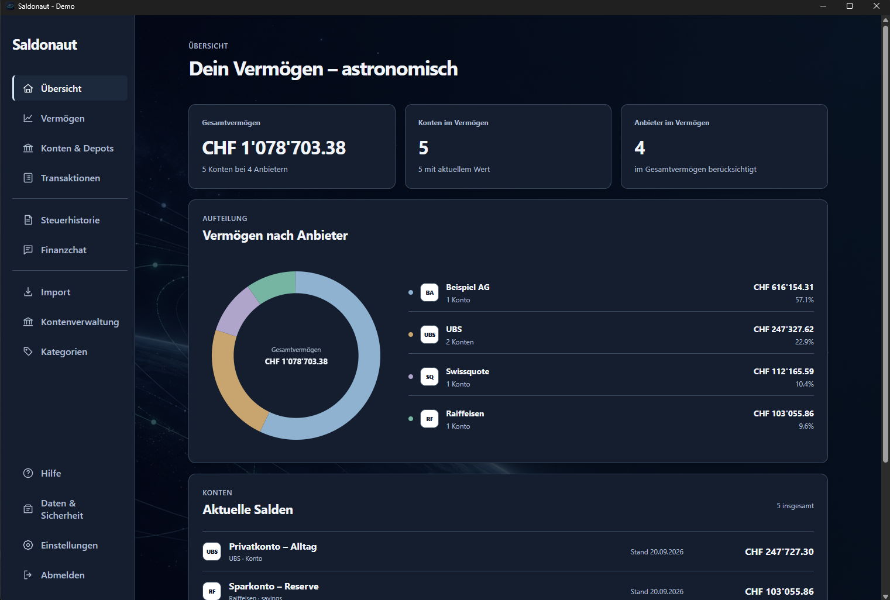
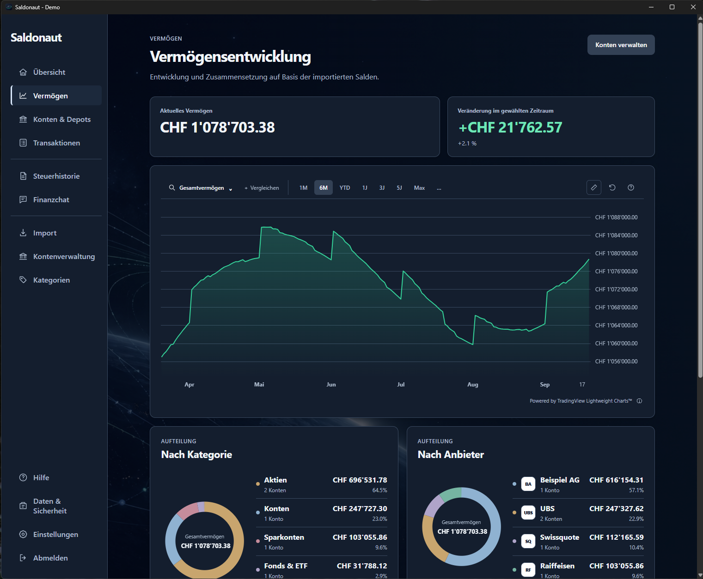

# Saldonaut

[English](README.md) | **Deutsch**


Deine Finanzen auf einen Blick: eine lokale Desktop-App, die Konten, Depots,
Vermögen und Ausgaben aus mehreren Banken und weiteren Finanzquellen in einer
gemeinsamen Sicht bündelt. Ohne Benutzerkonto oder Cloud-Synchronisierung.

## Installation unter Windows

[Saldonaut 0.6.9 für Windows herunterladen (64 Bit)](../../releases/download/v0.6.9/Saldonaut_0.6.9_x64-setup.exe)

[Versionshinweise](../../releases/tag/v0.6.9)
· [SHA-256-Prüfsumme](../../releases/download/v0.6.9/Saldonaut_0.6.9_x64-setup.exe.sha256)

Der Installer ist nicht signiert; Windows kann deshalb eine Sicherheitswarnung
anzeigen. Vor der Nutzung mit echten Daten immer ein verschlüsseltes Backup
erstellen. Die Demo ist enthalten: **Finanzprofil → Demo-Daten**, Passwort
**`demo1234`**.

## Installation unter macOS

[Saldonaut 0.6.5 für macOS herunterladen (Apple Silicon)](../../releases/download/v0.6.5/Saldonaut_0.6.5_aarch64.dmg)
· [SHA-256-Prüfsumme](../../releases/download/v0.6.5/Saldonaut_0.6.5_aarch64.dmg.sha256)

DMG öffnen, **Saldonaut** auf **Applications** ziehen und anschließend dort starten.
Die App ist ad-hoc signiert und nicht von Apple notarisiert. Bei einer Sperre nach
dem Download: **Systemeinstellungen → Datenschutz & Sicherheit → Dennoch öffnen**.
Dieses Image ist für Apple Silicon, nicht für Intel-Macs.

Build, DMG-Integrität, Signatur, Produktname, Version und sichtbarer Start bis zur
Anmeldung wurden auf macOS 27.0 geprüft. Details und Grenzen stehen in den
[macOS-Buildnotizen](installers/RELEASE-macOS-0.6.5.md).

## Funktionen

- Bankauszüge aus Excel, CSV, PDF, MT940 sowie camt.053 und camt.054 (ISO 20022) importieren und vor dem Speichern prüfen
- Konten, Aktien, ETFs, Kryptowährungen und Vorsorgevermögen gemeinsam auswerten
- Vermögensentwicklung, Geldfluss und Steuerhistorie visualisieren
- Interaktive Vermögenscharts mit Zoom, Messwerkzeug und optionalem Indexvergleich (SMI, S&P 500)
- Helle, dunkle oder systemabhängige Darstellung wählen
- Depotpositionen einzeln oder gemeinsam im Verlauf anzeigen; bei einer Position zwischen Wert und Kurs wechseln
- Konten und Depots in einer eigenen Leseansicht anschauen, getrennt von der Kontenverwaltung
- Positionsbestände zu einem Stichtag anbieterneutral importieren; Swissquote ist der erste unterstützte Anbieter
- Transaktionen kategorisieren und Kreditkartenzahlungen ohne Doppelzählung erfassen
- Unabhängige Finanzprofile erstellen, kopieren, anonymisieren und sichern
- Deutsch, Englisch, Französisch und Italienisch mit regionalen Zahlenformaten

Importvorlagen gibt es unter anderem für UBS inklusive Mastercard, Swissquote,
Migros Bank, Raiffeisen und Generali. [Testauszüge](fixtures/bank-statements)
enthalten nur erfundene Daten.

## Screenshots

### Übersicht

Die Demo-Übersicht bündelt Gesamtvermögen, Anbieter und aktuelle Kontosalden.



### Vermögensentwicklung

Das Demo-Profil zeigt Vermögensverlauf und Aufteilung in der optionalen kosmischen Darstellung.



## Einfach ausprobieren

In der Auswahl **Finanzprofil → Demo-Daten** findest du Banken, Aktien und ETFs,
kategorisierte Kreditkartenbuchungen und acht Jahre simulierter Historie.
Die Demo funktioniert offline und wird beim nächsten Öffnen wiederverwendet.

**Passwort für das Demo-Profil: `demo1234`** (alles kleingeschrieben, ohne Leerzeichen).

Für persönliche Daten wählst du **Neues Finanzprofil** und ein eigenes Passwort.
Demo-Kurse sind keine historischen Börsendaten oder Anlageempfehlungen.

## Optionaler Finanzchat

Unter **Finanzchat → Mit ChatGPT anmelden** verbindet sich Saldonaut über die
mitgelieferte Codex-Laufzeit mit einem unterstützten ChatGPT-Konto. Kein API-Schlüssel
und kein separates API-Guthaben erforderlich. Die Anmeldung wird pro Finanzprofil im geschützten Anmeldespeicher des Geräts
behalten und lässt sich im Finanzchat entfernen. Der Mikrofonknopf erkennt deutsche
Fragen lokal, ohne Audio hochzuladen. Standardmässig werden neue Datenpakete vor der Übermittlung
zur Prüfung angezeigt. Folgefragen verwenden den bestehenden Chatkontext und werden
ohne erneute Datenfreigabe gesendet. Ändern sich Daten, Zeitraum oder Kontenauswahl,
wird bei aktivierter Prüfung eine neue Freigabe verlangt. Unter **Datenschutz & Modell-Info** kann man freiwillig den
Fearless-Modus mit Detailtransaktionen für einen gewählten Zeitraum aktivieren und
unabhängig davon die Prüfung vor dem Senden ausschalten. Direktversand erfolgt dann
mit Enter oder Sendepfeil. Fragen nach Kreditkarten werden automatisch auf aktive
Kreditkartenkonten begrenzt; unter **Kontenauswahl** lässt sich der Umfang auch
ausdrücklich wählen. Allgemeines Einkommen und Vermögen werden bei reinen
Kreditkartenfragen nicht mitgegeben. Der Chatbot bleibt rein lesend.

Im freiwilligen Fearless-Modus werden auch Buchungsbeschreibungen übertragen,
damit Händlerfragen möglich sind. Diese Texte können persönliche Angaben enthalten.
Separate Konto- und Banknamen, IBAN, Kontonummern, Inhaber- und Adressfelder bleiben
ausgeschlossen; Angaben innerhalb von Beschreibungen, Kategorienamen und Fragen
werden jedoch mitgesendet. „Neuer Chat“, Verlassen
oder Sperren beendet den flüchtigen Chatkontext; die Anmeldung bleibt gespeichert.

Details, Grenzen und Tests: [Finanzchat](docs/finance-chat.md).

## Datenschutz und Backup

Finanzdaten werden auf deinem Gerät mit SQLCipher verschlüsselt gespeichert.
Für automatische Bewertungen werden Wertpapierkennungen, Zeiträume und
Währungspaare an Marktdatenanbieter übermittelt – keine Kontostände oder Buchungen.

Unter **Daten & Sicherheit** kannst du dein Passwort ändern und verschlüsselte
Backups per Dateidialog erstellen oder wiederherstellen. Eine Wiederherstellung
legt ein zusätzliches Finanzprofil an; bestehende Daten bleiben erhalten.

**Wichtig:** Es gibt keinen Passwort-Reset. Backups benötigen das Passwort vom
Zeitpunkt der Sicherung. Bewahre sie möglichst auf einem anderen Datenträger auf.

## Lizenz

Der eigene Quellcode steht unter der [MIT-Lizenz](LICENSE).
[Abhängigkeiten](DEPENDENCIES.md) behalten ihre eigenen Lizenzen; deren Texte und
Hinweise stehen in [THIRD_PARTY_LICENSES.txt](THIRD_PARTY_LICENSES.txt) und werden
im Installer mitgeliefert. Banklogos werden nicht mitgeliefert; stattdessen
erscheinen Kürzel. Eigene Logos lassen sich lokal im Finanzprofil hochladen.

## Entwicklung

Tauri 2 · React · TypeScript · Rust · SQLCipher

Voraussetzungen: Node.js 22+, Rust/Cargo und die Tauri-Systemabhängigkeiten.
Unter Windows zusätzlich WebView2, Microsoft C++ Build Tools und natives Perl
für den OpenSSL-Build. Unter macOS werden die Xcode Command Line Tools
(`xcode-select --install`) und Perl für den OpenSSL-Build benötigt.

```sh
npm install
npm run tauri dev
```

`npm run dev` startet nur die Weboberfläche ohne native Funktionen.

Tests und Build:

```sh
npm test
npm run build
cargo test --manifest-path src-tauri/Cargo.toml --lib
```

Alle eingecheckten Tests verwenden synthetische Daten. Echte Finanzdaten gehören
nicht ins Repository.

Veröffentlichungs-Build: `node scripts/release.mjs --bundles nsis` (Windows).
`CARGO_TARGET_DIR` muss dabei auf ein neutrales Verzeichnis außerhalb des
Repositories und Benutzerprofils zeigen. Ein frischer OpenSSL-Build benötigt
eine vollständige native Perl-Installation im Build-PATH, empfohlen wird
Strawberry Perl. Das reduzierte Perl aus Git for Windows reicht nicht aus. Vor
dem Build lässt sich die Voraussetzung mit
`perl -MIPC::Cmd -MLocale::Maketext::Simple -e 1` prüfen. Bei einer portablen
Strawberry-Perl-Ausgabe müssen `perl\bin` und `c\bin` vor Git im `PATH` stehen.
Perl ist keine Voraussetzung für die fertige App.
Für ein natives macOS-DMG auf einem Mac:

```sh
cargo fetch --manifest-path src-tauri/Cargo.toml --locked
CARGO_TARGET_DIR=/tmp/saldonaut-build npm run release:mac
```

Das DMG liegt danach unter `/tmp/saldonaut-build/release/bundle/dmg/`.
Die Architektur entspricht dem Build-Mac: Apple Silicon erzeugt `aarch64`,
Intel erzeugt `x64`. Das DMG kann als Asset eines GitHub-Releases hochgeladen
werden. Der Build veröffentlicht nichts automatisch.
Seit 0.5.7 wird das grössere DMG mit Chat-Runtime und Sprachmodell als Release-Asset
bereitgestellt; die Prüfsumme liegt auch im Repository unter `installers`.

Das plattformneutrale Build-Skript sammelt Lizenzhinweise, neutralisiert lokale
Rust-Build-Pfade und prüft die ausführbare Datei vor der Weitergabe.
Die macOS-Konfiguration verwendet eine Ad-hoc-Signatur. Für eine von Apple
signierte und notarisierte Veröffentlichung sind ein Developer-ID-Zertifikat
und die entsprechende Tauri-Signierungs-/Notarisierungskonfiguration nötig;
siehe [Tauri macOS Code Signing](https://v2.tauri.app/distribute/sign/macos/).
Für native Bibliotheken wie OpenSSL muss auch `CARGO_TARGET_DIR` auf ein neutrales
Build-Verzeichnis ohne persönlichen Benutzernamen zeigen. Ein fehlgeschlagener
Pfadcheck bedeutet, dass der erzeugte Installer nicht veröffentlicht werden darf.
Hinweise zur Veröffentlichung und zum Umgang mit lokalen Daten stehen in
[SECURITY.md](SECURITY.md).
