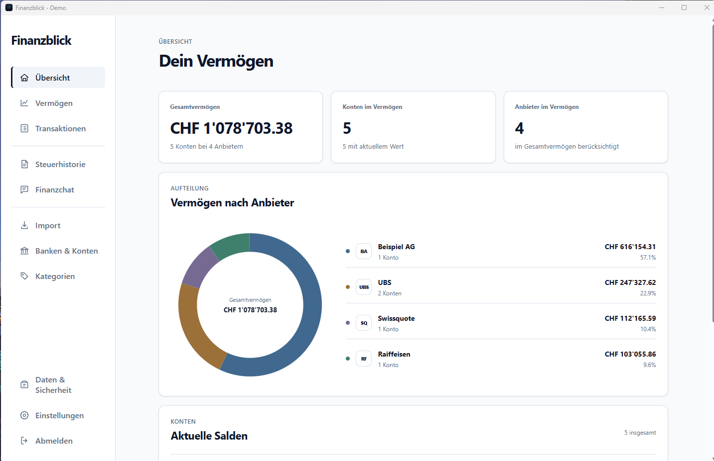
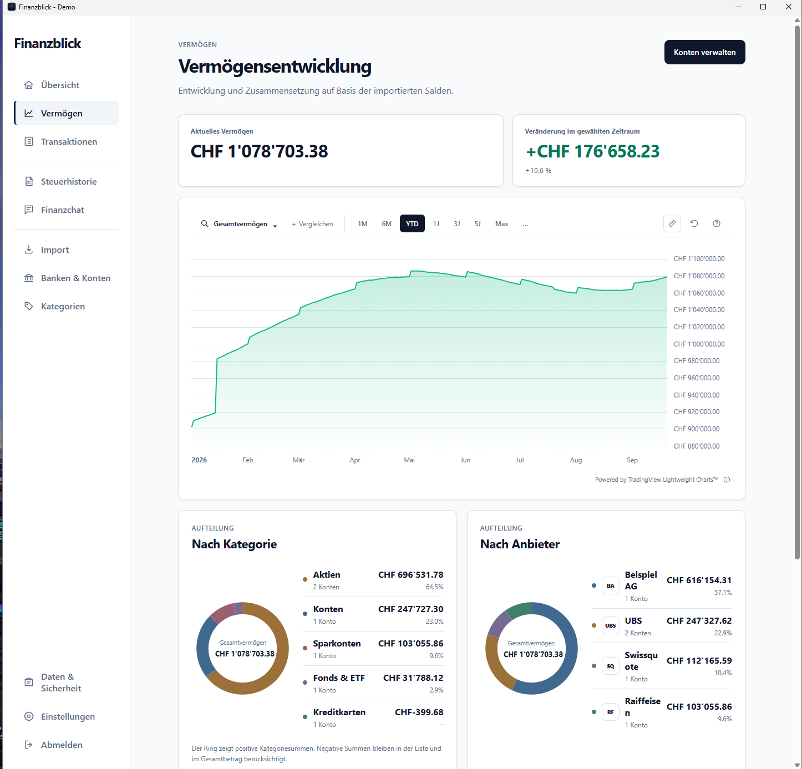
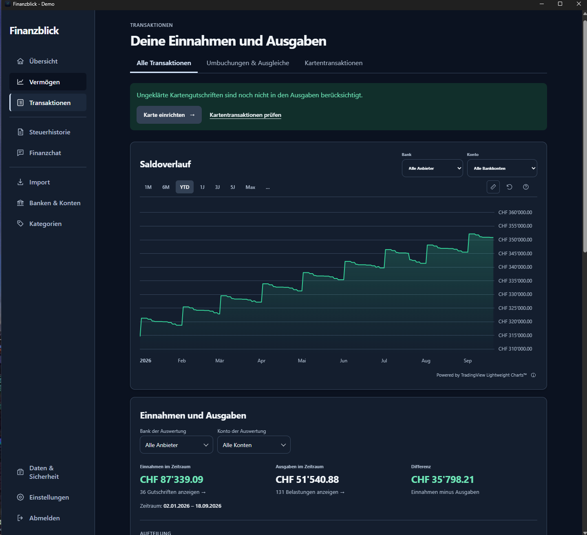

# Finanzblick

**English** | [Deutsch](README.de.md)

Your finances at a glance: a local desktop app that brings accounts, investment
portfolios, net worth and spending from multiple banks and other financial
sources into one view. No app account or cloud sync required.

## Install on Windows

[Download the Windows installer 0.6.2 (64-bit)](https://github.com/leviathary/Finanzblick/releases/download/v0.6.2/Finanzblick_0.6.2_x64-setup.exe)

[Release notes](https://github.com/leviathary/Finanzblick/releases/tag/v0.6.2)
· [SHA-256 checksum](https://github.com/leviathary/Finanzblick/releases/download/v0.6.2/Finanzblick_0.6.2_x64-setup.exe.sha256)

Run the downloaded file. Windows Developer Mode is not required.
The installer is unsigned, so Windows may display a security warning.
This is an early test version: create a backup before using it with real data.

The demo is included: **Financial profile → Demo data**, password **`demo1234`**.
It is created locally on first use; no additional download is needed.
If WebView2 is missing, its installation requires an internet connection.

## Install on macOS

[Download the macOS DMG 0.5.7 (Apple Silicon)](https://github.com/leviathary/Finanzblick/releases/download/v0.5.7/Finanzblick_0.5.7_aarch64.dmg)

For Macs with Apple Silicon (M-series chips). Open the DMG, drag **Finanzblick**
to **Applications**, then launch the app from Applications.

This test version is ad-hoc signed, but not notarized by Apple.
If macOS blocks it after downloading, allow it under
**System Settings → Privacy & Security → Open Anyway**.
The DMG does not include an Intel build.

Version 0.5.7 includes Finance chat and the local German speech model.
The build, DMG verification and launch with the demo overview were successfully
tested on macOS 26.6.2 (Apple Silicon) on September 15, 2026.
The 13 frontend tests, 81 active Rust tests and an additional local chat-runtime
test passed on macOS. Keychain sign-in was tested with synthetic data for
persistence, profile isolation and sign-out. Installation and operation of the
earlier version 0.5.3 were confirmed by the user. Other macOS versions and a
fresh installation after downloading from GitHub have not yet been tested.

## Screenshots

All screenshots show version 0.6.1 with fictional sample data. Accounts,
providers, transactions and price histories are invented. The screenshots use the
German interface; English, French and Italian are also available in the app.

### Net worth overview



### Interactive net worth history

Choose a date range, zoom with the mouse wheel, pan through the chart or use the
measurement tool to explore changes. Contextual help explains the controls.



### Dark mode

Choose a light, dark or system appearance in Settings.



## Features

- Import bank statements from Excel, CSV, PDF, MT940, camt.053 and camt.054 (ISO 20022), and review them before saving
- View bank accounts, stocks, ETFs, cryptocurrencies and retirement assets together
- Visualize net worth, cash flow and tax history
- Explore interactive net worth charts with zoom, measurement tools and optional index comparisons (SMI, S&P 500)
- Choose a light, dark or system appearance
- View portfolio positions individually or together over time; switch between position value and price for a single position
- Categorize transactions and account for credit card payments without double-counting
- Create, copy, anonymize and back up independent financial profiles
- Use German, English, French or Italian with regional number formats

Import templates include UBS (including Mastercard), Swissquote, Migros Bank,
Raiffeisen and Generali. [Sample statements](fixtures/bank-statements) contain
fictional data only.

## Try the demo

Select **Financial profile → Demo data** to explore banks, stocks and ETFs,
categorized credit card transactions and eight years of simulated history.
The demo works offline and is reused the next time you open it.

**Demo profile password: `demo1234`** (lowercase, no spaces).

For personal data, choose **New financial profile** and set your own password.
Demo prices are not historical market data or investment advice.

## Optional Finance chat

Under **Finance chat → Sign in with ChatGPT**, Finanzblick connects to a supported
ChatGPT account using the bundled Codex runtime. No API key or separate API
credit is required. Sign-in is stored per financial profile in the device's
protected credential store and can be removed in Finance chat. The microphone
button recognizes German questions locally, without uploading audio.

By default, new data packages are shown for review before being sent.
Follow-up questions reuse the existing chat context and are sent without asking
for data approval again. When data, date range or account selection changes,
another approval is requested if review is enabled. Under **Privacy & model info**,
you can optionally enable Fearless mode with detailed transactions for a chosen
period, and independently disable review before sending. Direct sending then
uses Enter or the send arrow. Credit card questions are automatically limited
to active credit card accounts; **Account selection** also lets you choose the
scope explicitly. General income and net worth are not included for questions
limited to credit cards. The assistant remains read-only.

Optional Fearless mode also sends transaction descriptions to support questions
about merchants. These texts may contain personal information. Separate account
and bank names, IBANs, account numbers, account-holder and address fields are
excluded; information within descriptions, category names and questions is still
sent. **New chat**, leaving the chat or locking the app ends the temporary chat
context; sign-in remains saved.

Details, limitations and tests: [Finance chat](docs/finance-chat.md) (German).

## Privacy and backups

Financial data is stored on your device, encrypted with SQLCipher.
For automatic valuations, security identifiers, date ranges and currency pairs
are sent to market data providers—not account balances or transactions.

Under **Data & security**, you can change your password and create or restore
encrypted backups using a file dialog. Restoring a backup creates an additional
financial profile; existing data is preserved.

**Important:** There is no password reset. Backups require the password that was
active when they were created. Keep them on a separate storage device if possible.

## License

The project's own source code is available under the [MIT License](LICENSE).
[Dependencies](DEPENDENCIES.md) retain their own licenses. Their license texts
and notices are included in [THIRD_PARTY_LICENSES.txt](THIRD_PARTY_LICENSES.txt)
and bundled with the installer. Bank logos are not bundled; initials are shown
instead. You can upload custom logos locally within your financial profile.

## Development

Tauri 2 · React · TypeScript · Rust · SQLCipher

Requirements: Node.js 22+, Rust/Cargo and the Tauri system dependencies.
Windows also requires WebView2, Microsoft C++ Build Tools and native Perl for
the OpenSSL build. macOS requires Xcode Command Line Tools
(`xcode-select --install`) and Perl for the OpenSSL build.

```sh
npm install
npm run tauri dev
```

`npm run dev` starts only the web interface, without native functionality.

Tests and build:

```sh
npm test
npm run build
cargo test --manifest-path src-tauri/Cargo.toml --lib
```

All committed tests use synthetic data. Real financial data must not be added
to the repository.

Release build: `node scripts/release.mjs --bundles nsis` (Windows).
Set `CARGO_TARGET_DIR` to a neutral directory outside the repository and user
profile. A fresh OpenSSL build also requires Perl on the build PATH; this is
not a requirement for the installed app.
To build a native macOS DMG on a Mac:

```sh
cargo fetch --manifest-path src-tauri/Cargo.toml --locked
CARGO_TARGET_DIR=/tmp/finanzblick-build npm run release:mac
```

The DMG is generated under `/tmp/finanzblick-build/release/bundle/dmg/`.
Its architecture matches the build Mac: Apple Silicon produces `aarch64`, Intel
produces `x64`. The DMG can be uploaded as a GitHub Release asset. The build does
not publish anything automatically. Since 0.5.7, the larger DMG with the chat
runtime and speech model is distributed as a release asset; its checksum is
also stored in the repository under `installers`.

The cross-platform build script collects license notices, remaps local Rust
build paths and checks the executable before distribution. The macOS
configuration uses an ad-hoc signature. An Apple-signed, notarized release
requires a Developer ID certificate and the corresponding Tauri signing and
notarization configuration; see
[Tauri macOS Code Signing](https://v2.tauri.app/distribute/sign/macos/).
For native libraries such as OpenSSL, `CARGO_TARGET_DIR` must also point to a
neutral build directory without a personal username. If the path check fails,
the generated installer must not be published. Publication and local-data
handling guidelines are available in [SECURITY.md](SECURITY.md).
