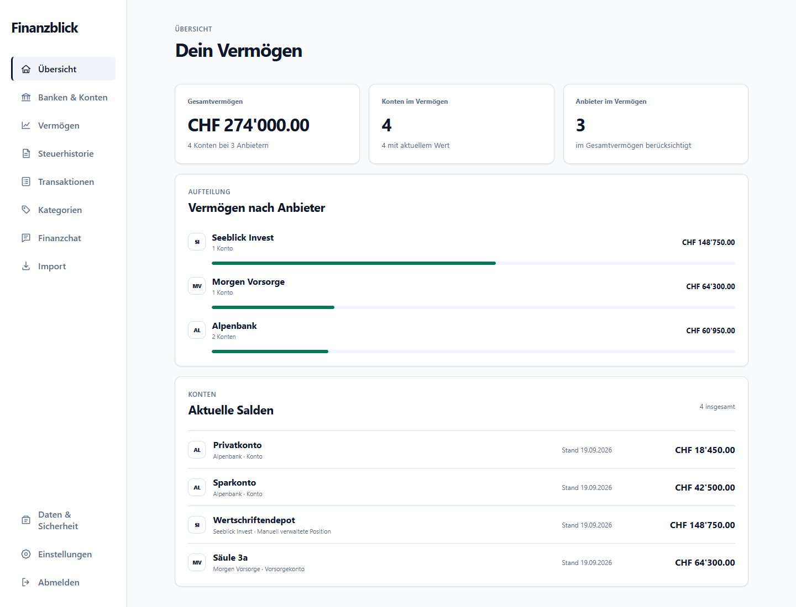
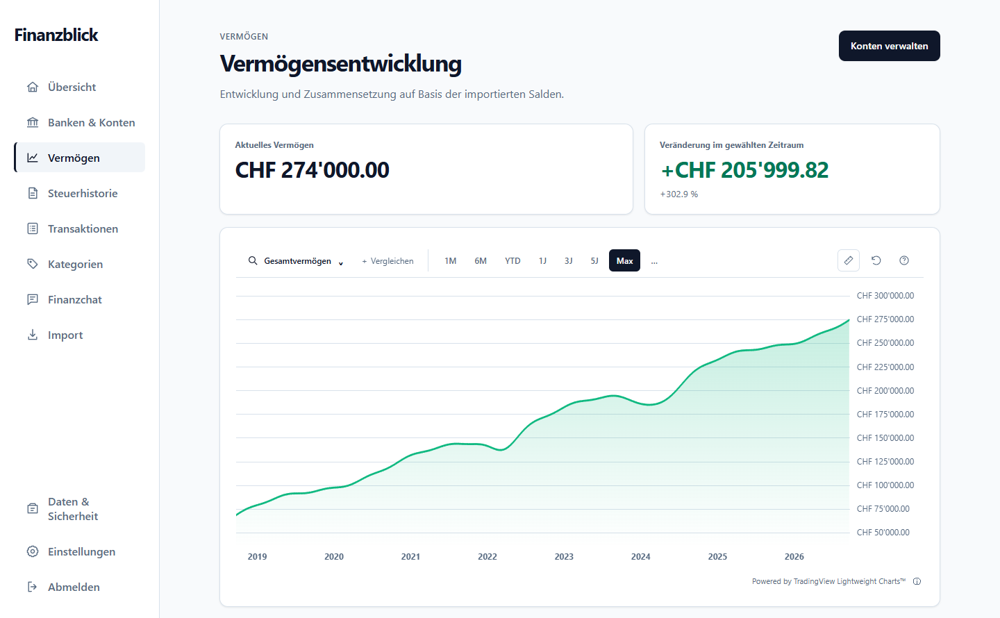
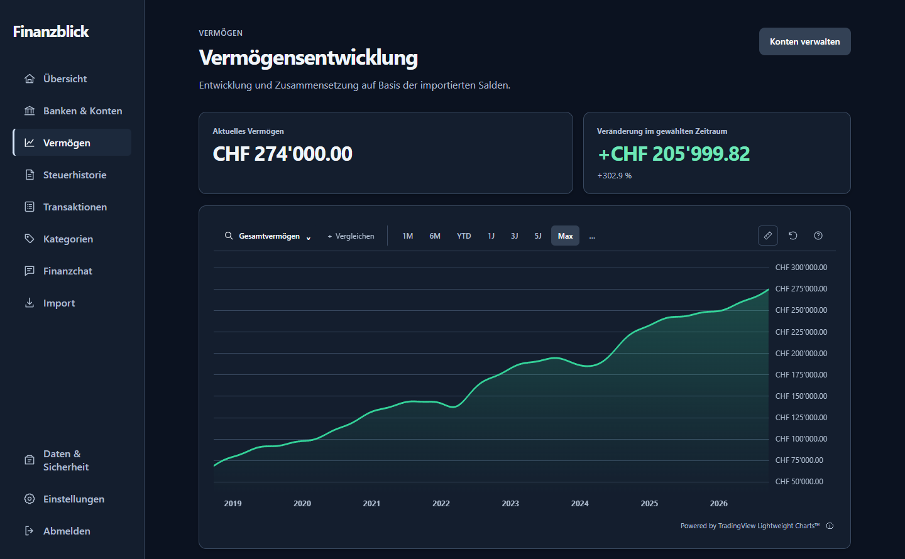

# Finanzblick

Deine Finanzen auf einen Blick: eine lokale Desktop-App für Konten, Depots,
Vermögen und Ausgaben. Ohne Benutzerkonto oder Cloud-Synchronisierung.

## Windows installieren

[Windows-Installer 0.5.10 herunterladen (64 Bit)](https://github.com/leviathary/Finanzblick/releases/download/v0.5.10/Finanzblick_0.5.10_x64-setup.exe)

[Release-Notizen](https://github.com/leviathary/Finanzblick/releases/tag/v0.5.10)
· [SHA-256-Prüfsumme](https://github.com/leviathary/Finanzblick/releases/download/v0.5.10/Finanzblick_0.5.10_x64-setup.exe.sha256)

Die heruntergeladene Datei ausführen. Ein Windows-Entwicklermodus ist nicht nötig.
Der Installer ist nicht signiert; Windows kann deshalb eine Sicherheitswarnung anzeigen.
Frühe Testversion: vor der Nutzung mit echten Daten ein Backup erstellen.

Die Demo ist bereits enthalten: **Finanzprofil → Demo-Daten**, Passwort **`demo1234`**.
Sie wird beim ersten Öffnen lokal erzeugt; es ist kein zusätzlicher Download nötig.
Falls WebView2 fehlt, benötigt dessen Einrichtung eine Internetverbindung.

## macOS installieren

[macOS-DMG 0.5.7 herunterladen (Apple Silicon)](https://github.com/leviathary/Finanzblick/releases/download/v0.5.7/Finanzblick_0.5.7_aarch64.dmg)

Für Macs mit Apple Silicon (M-Chips). DMG öffnen und **Finanzblick** auf **Applications**
ziehen, danach die App aus dem Programme-Ordner starten.

Diese Testversion ist ad-hoc signiert, aber nicht von Apple notarisiert.
Bei einer Sperre nach dem Download lässt sich der Start unter
**Systemeinstellungen → Datenschutz & Sicherheit → Dennoch öffnen** freigeben.
Eine Intel-Version ist in diesem DMG nicht enthalten.

Version 0.5.7 enthält Finanzchat und das lokale deutsche Sprachmodell.
Build, DMG-Prüfung und Start mit Demo-Übersicht wurden am 15.09.2026 auf
macOS 26.6.2 (Apple Silicon) erfolgreich geprüft.
Die 13 Frontend- und 81 aktiven Rust-Tests sowie der zusätzliche lokale
Chat-Runtime-Test bestehen auf macOS. Die Schlüsselbund-Anmeldung wurde mit
synthetischen Testdaten auf Speicherung, Profiltrennung und Abmeldung geprüft.
Installation und Funktion der vorherigen Version 0.5.3 wurden vom Anwender bestätigt.
Andere macOS-Versionen und eine frische Installation nach einem GitHub-Download
sind noch nicht getestet.

## Einblick

Die Screenshots zeigen die Oberfläche von Version 0.5.10 mit ausschliesslich
fiktiven Beispieldaten. Konten, Anbieter und Kursverläufe sind erfunden.

### Vermögensübersicht



### Interaktive Vermögensentwicklung

Zeitraum wählen, mit dem Mausrad zoomen, den Verlauf verschieben oder mit dem
Messwerkzeug Veränderungen untersuchen. Die Kontexthilfe erklärt die Bedienung.



### Dark Mode

Unter Einstellungen zwischen heller, dunkler und systemabhängiger Darstellung wechseln.



## Funktionen

- Bankauszüge aus Excel, CSV, PDF und MT940 importieren und vor dem Speichern prüfen
- Konten, Aktien, ETFs, Kryptowährungen und Vorsorgevermögen gemeinsam auswerten
- Vermögensentwicklung, Geldfluss und Steuerhistorie visualisieren
- Interaktive Vermögenscharts mit Zoom, Messwerkzeug und optionalem Indexvergleich (SMI, S&P 500)
- Helle, dunkle oder systemabhängige Darstellung wählen
- Depotpositionen einzeln oder gemeinsam im Verlauf anzeigen; bei einer Position zwischen Wert und Kurs wechseln
- Transaktionen kategorisieren und Kreditkartenzahlungen ohne Doppelzählung erfassen
- Unabhängige Finanzprofile erstellen, kopieren, anonymisieren und sichern
- Deutsch, Englisch, Französisch und Italienisch mit regionalen Zahlenformaten

Importvorlagen gibt es unter anderem für UBS inklusive Mastercard, Swissquote,
Migros Bank, Raiffeisen und Generali. [Testauszüge](fixtures/bank-statements)
enthalten nur erfundene Daten.

## Einfach ausprobieren

In der Auswahl **Finanzprofil → Demo-Daten** findest du Banken, Aktien und ETFs,
kategorisierte Kreditkartenbuchungen und acht Jahre simulierter Historie.
Die Demo funktioniert offline und wird beim nächsten Öffnen wiederverwendet.

**Passwort für das Demo-Profil: `demo1234`** (alles kleingeschrieben, ohne Leerzeichen).

Für persönliche Daten wählst du **Neues Finanzprofil** und ein eigenes Passwort.
Demo-Kurse sind keine historischen Börsendaten oder Anlageempfehlungen.

## Optionaler Finanzchat

Unter **Finanzchat → Mit ChatGPT anmelden** verbindet sich Finanzblick über die
mitgelieferte Codex-Laufzeit mit einem unterstützten ChatGPT-Konto. Kein API-Schlüssel
und kein separates API-Guthaben erforderlich. Die Anmeldung wird pro Finanzprofil im geschützten Anmeldespeicher des Geräts
behalten und lässt sich im Finanzchat entfernen. Der Mikrofonknopf erkennt deutsche
Fragen lokal, ohne Audio hochzuladen. Standardmässig werden neue Datenpakete vor der Übermittlung
zur Prüfung angezeigt. Folgefragen verwenden den bestehenden Chatkontext und werden
ohne erneute Datenfreigabe gesendet. Ändern sich Daten, Zeitraum oder Kontenauswahl,
wird bei aktivierter Prüfung eine neue Freigabe verlangt. Unter **Datenschutz & Modell-Info** kann man freiwillig den
Fearless-Modus mit Detailtransaktionen für einen gewählten Zeitraum aktivieren und
unabhängig davon die Prüfung vor dem Senden ausschalten. Direktversand erfolgt dann
mit Enter oder Sendepfeil. Fragen nach Kreditkarten werden automatisch auf aktive
Kreditkartenkonten begrenzt; unter **Kontenauswahl** lässt sich der Umfang auch
ausdrücklich wählen. Allgemeines Einkommen und Vermögen werden bei reinen
Kreditkartenfragen nicht mitgegeben. Der Chatbot bleibt rein lesend.

Im freiwilligen Fearless-Modus werden auch Buchungsbeschreibungen übertragen,
damit Händlerfragen möglich sind. Diese Texte können persönliche Angaben enthalten.
Separate Konto- und Banknamen, IBAN, Kontonummern, Inhaber- und Adressfelder bleiben
ausgeschlossen; Angaben innerhalb von Beschreibungen, Kategorienamen und Fragen
werden jedoch mitgesendet. „Neuer Chat“, Verlassen
oder Sperren beendet den flüchtigen Chatkontext; die Anmeldung bleibt gespeichert.

Details, Grenzen und Tests: [Finanzchat](docs/finance-chat.md).

## Datenschutz und Backup

Finanzdaten werden auf deinem Gerät mit SQLCipher verschlüsselt gespeichert.
Für automatische Bewertungen werden Wertpapierkennungen, Zeiträume und
Währungspaare an Marktdatenanbieter übermittelt – keine Kontostände oder Buchungen.

Unter **Daten & Sicherheit** kannst du dein Passwort ändern und verschlüsselte
Backups per Dateidialog erstellen oder wiederherstellen. Eine Wiederherstellung
legt ein zusätzliches Finanzprofil an; bestehende Daten bleiben erhalten.

**Wichtig:** Es gibt keinen Passwort-Reset. Backups benötigen das Passwort vom
Zeitpunkt der Sicherung. Bewahre sie möglichst auf einem anderen Datenträger auf.

## Lizenz

Der eigene Quellcode steht unter der [MIT-Lizenz](LICENSE).
[Abhängigkeiten](DEPENDENCIES.md) behalten ihre eigenen Lizenzen; deren Texte und
Hinweise stehen in [THIRD_PARTY_LICENSES.txt](THIRD_PARTY_LICENSES.txt) und werden
im Installer mitgeliefert. Banklogos werden nicht mitgeliefert; stattdessen
erscheinen Kürzel. Eigene Logos lassen sich lokal im Finanzprofil hochladen.

## Entwicklung

Tauri 2 · React · TypeScript · Rust · SQLCipher

Voraussetzungen: Node.js 22+, Rust/Cargo und die Tauri-Systemabhängigkeiten.
Unter Windows zusätzlich WebView2, Microsoft C++ Build Tools und natives Perl
für den OpenSSL-Build. Unter macOS werden die Xcode Command Line Tools
(`xcode-select --install`) und Perl für den OpenSSL-Build benötigt.

```sh
npm install
npm run tauri dev
```

`npm run dev` startet nur die Weboberfläche ohne native Funktionen.

Tests und Build:

```sh
npm test
npm run build
cargo test --manifest-path src-tauri/Cargo.toml --lib
```

Alle eingecheckten Tests verwenden synthetische Daten. Echte Finanzdaten gehören
nicht ins Repository.

Veröffentlichungs-Build: `node scripts/release.mjs --bundles nsis` (Windows).
`CARGO_TARGET_DIR` muss dabei auf ein neutrales Verzeichnis außerhalb des
Repositories und Benutzerprofils zeigen. Ein frischer OpenSSL-Build benötigt
zusätzlich Perl im Build-PATH; dies ist keine Voraussetzung für die fertige App.
Für ein natives macOS-DMG auf einem Mac:

```sh
cargo fetch --manifest-path src-tauri/Cargo.toml --locked
CARGO_TARGET_DIR=/tmp/finanzblick-build npm run release:mac
```

Das DMG liegt danach unter `/tmp/finanzblick-build/release/bundle/dmg/`.
Die Architektur entspricht dem Build-Mac: Apple Silicon erzeugt `aarch64`,
Intel erzeugt `x64`. Das DMG kann als Asset eines GitHub-Releases hochgeladen
werden. Der Build veröffentlicht nichts automatisch.
Seit 0.5.7 wird das grössere DMG mit Chat-Runtime und Sprachmodell als Release-Asset
bereitgestellt; die Prüfsumme liegt auch im Repository unter `installers`.

Das plattformneutrale Build-Skript sammelt Lizenzhinweise, neutralisiert lokale
Rust-Build-Pfade und prüft die ausführbare Datei vor der Weitergabe.
Die macOS-Konfiguration verwendet eine Ad-hoc-Signatur. Für eine von Apple
signierte und notarisierte Veröffentlichung sind ein Developer-ID-Zertifikat
und die entsprechende Tauri-Signierungs-/Notarisierungskonfiguration nötig;
siehe [Tauri macOS Code Signing](https://v2.tauri.app/distribute/sign/macos/).
Für native Bibliotheken wie OpenSSL muss auch `CARGO_TARGET_DIR` auf ein neutrales
Build-Verzeichnis ohne persönlichen Benutzernamen zeigen. Ein fehlgeschlagener
Pfadcheck bedeutet, dass der erzeugte Installer nicht veröffentlicht werden darf.
Hinweise zur Veröffentlichung und zum Umgang mit lokalen Daten stehen in
[SECURITY.md](SECURITY.md).
